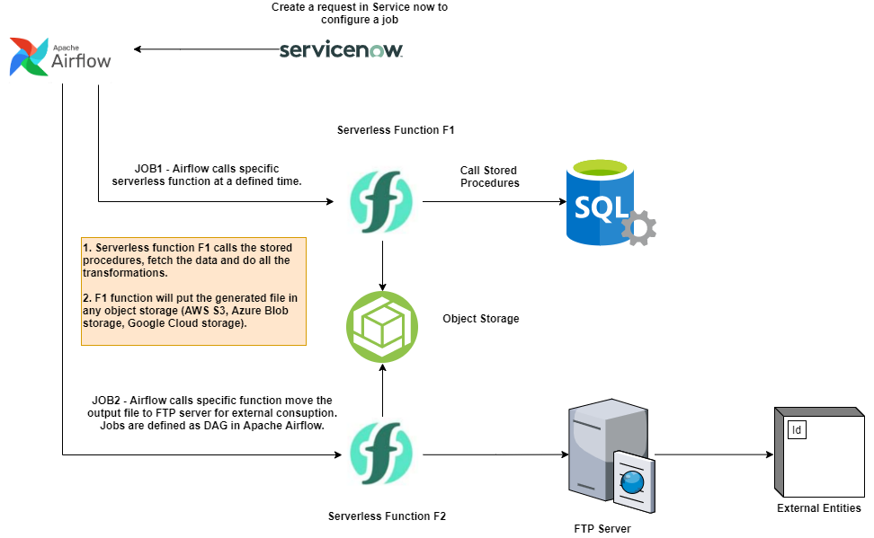

# etl-serverless

This project explains the architecture for using Serverless platform (AWS Lambda, Google Cloud Functions, Microsoft Azure Functions or on-premise Serverless platforms).

### Existing architecture

### Proposed architecture

The detailed design using Serverless platform is as follows:

### Design Decisions

### Logging

### Monitoring

### Lessons Learnt

### CI/CD Pipelines

