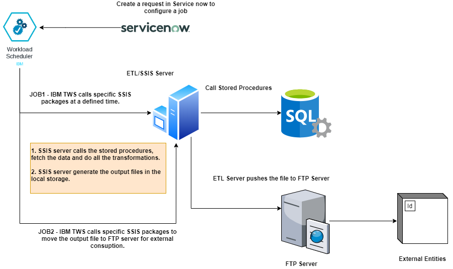

# etl-serverless

This explains the architecture for ETL workloads using Serverless platforms. Though it primarily focuses on Serverless platform built using Knative & K8s, but this is equally applicable for AWS Lambda, Google Cloud Functions, Microsoft Azure Functions or any on-premise Serverless platforms. The idea is to deploy the docker image in the serverless platform instead of creating SSIS packages. It can save huge license costs using serverless platform. 

### Existing architecture

The existing architecture leverages SSIS packages for different tasks/jobs. The **disadvatages** are as follows:

- Huge License Costs
- Operational Maintenance Costs to update the ETL server to the latest versions
- HA/DR solution must be established by keeping more VMs
- No automated CI/CD Pipelines
- Huge deployment cycles

### Proposed architecture

The detailed design using Serverless platform is as follows. We can replace any serverless-platform in this design. The idea is to split the business logic using any programming language and interact the functions via event-driven architecture.

**Advantages** are as follows:

- Huge Costs Savings
- Pay As you Go Model
- No need to maintain different VMs
- No future Operational Costs
- Automated CI/CD Pipelines
- Faster Deployments via DevOps
- Deamless Scalability 
- Imporvide Relaibility (HA/DR) provided out-of-the-box by the respective platform.

### Design Decisions & Lessons Learnt

- Servereless platforms are mostly suitable for state-less applications as the state of the app cannot be stored inside the functions.
- Business logic must be splitted into different functions. And these functions should interact via events or persistent storage as shown above.
- The different tasks/jobs/functions should be of less duration (a few minutes only). To be updated for rach platform.
- Should not allocate too many resources (CPU & Memory). 
- There are a few limitations considering the programming language. Must evaluate the supported languages before finalizing the platform. To be updated for each platform.
- Programming language that has the faster startup footprint is generally preferred. Python and Nodejs are preferred in this eco-system. However, Java with Quarkus is also picking up.

### CI/CD Pipelines

The automated CI/CD pipeline can be established using Jenkins or Azure DevOps server provided there is an integration with the respective serverless platform.

In the below design, as soon as developer check-in the code, the code can be compiled & the docker image can be created and published in JFrog artifactory. A separate relase pipeline can be created to deploy the updated source-code in different environment (dev, test, stage, prod). 

### 

